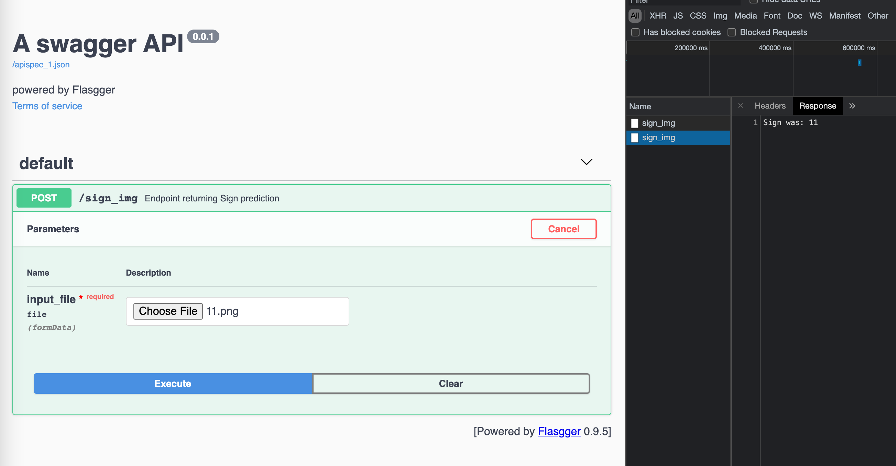
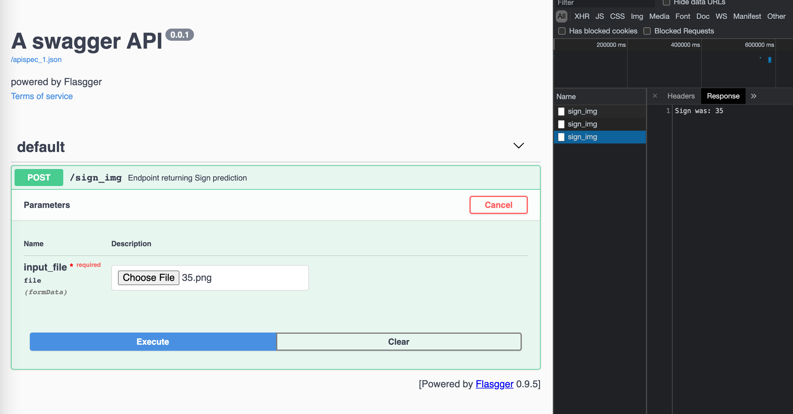
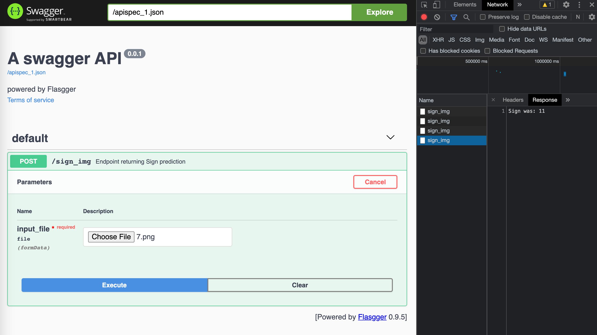
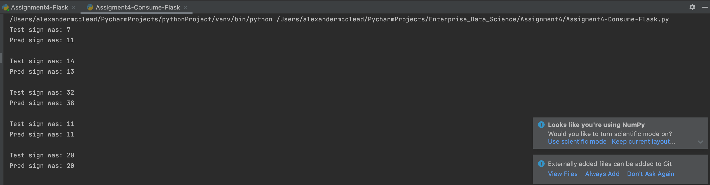

# Assigment4 Documentation:
## Stage 1: Adjusting Assigment3
I started by copying assignment3's work, see [Assignment4-CreateModel.ipynb](Assignment4-CreateModel.ipynb), since it already had the image classification already set up. I had some difficulty with pickling the CNN model, so I found a way to save the model as a .json and the weights as an .h5 file.

## Stage 2: Setting up the Flask API
I found I had some more difficulties with setting up the flask api. After some assistance I was able to run and use the api for the web ui. I titled the file [Assignment4-Flask.py](Assignment4-Flask.py). Below are some examples of the web api in use.

## Stage 3: Consuming the api
Once the api was up and running I was able to consume it using the requests module, see [Assignment4-Consume-Flask.py](Assignment4-Consume-Flask.py). Examples of the use are below.

### Notes on setup:
I had to switch to local setup of my mlflow server which required me to use homebrew to reinstall python and mlflow. That also meant I had to run change the port for mlflow to 5001 as swagger and mlflow use port 5000.

I also created a directory for the saved model signimg_class_json.